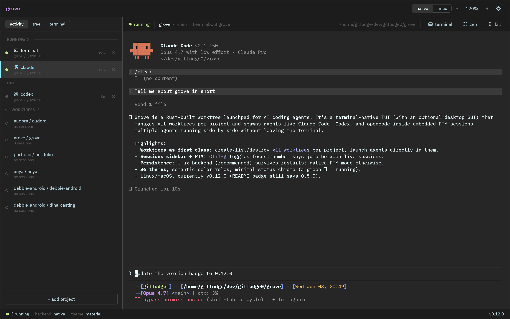

<div align="center">

# grove

a worktree launchpad for ai coding agents



[](#license)
[](#requirements)
[](https://www.rust-lang.org/)
[](Cargo.toml)

</div>

grove is a native desktop app and terminal TUI for managing git worktrees across projects and running ai coding agents (claude code, codex, opencode) in embedded PTY sessions inside each worktree. several agents run side by side, with optional tmux persistence when you want sessions to survive restarts.

## table of contents

- [why grove](#why-grove)
- [install](#install)
  - [desktop app](#desktop-app)
- [quickstart](#quickstart)
- [sessions](#sessions)
- [terminal UI](#terminal-ui)
- [supported agents](#supported-agents)
- [themes](#themes)
- [requirements](#requirements)
- [uninstall](#uninstall)
- [license](#license)

## why grove

if you regularly drive more than one ai coding agent at a time, you have probably ended up with a tab graveyard, a forest of detached tmux sessions, or a window manager full of nearly-identical terminals. grove collapses that into one focused surface.

- **projects, worktrees, and sessions in one place.** the sidebar can show a project tree, a flat activity stream of every session, or a persistent home terminal.
- **sessions are the unit of work.** every agent you spawn lives in a managed session with an embedded PTY. switch sessions without leaving grove, or open a worktree terminal beside an active agent.
- **worktrees, not branches.** grove treats `git worktree` as a first-class primitive. create, list, and destroy worktrees per project, and launch agents directly inside them.
- **desktop by default, terminal when you want it.** `grove` opens the iced desktop app; `grove tui` opens the keyboard-driven terminal UI.
- **native PTYs.** agents run as real terminal sessions, so full-screen CLIs, mouse selection, paste, scrollback, and terminal output behave like terminal work.
- **stays out of the way.** running sessions are visible in the sidebar without turning the app into a dashboard.
- **persistent by default.** with tmux installed, sessions survive grove exits and are rediscovered on the next launch. without tmux, native mode runs PTYs directly.

## install

one-liner (requires `git` and a rust toolchain):

```sh
curl -fsSL https://raw.githubusercontent.com/gitfudge0/grove/main/install.sh | bash
```

or clone and install locally:

```sh
git clone https://github.com/gitfudge0/grove.git
cd grove
./install.sh
```

the `grove` binary is installed to `$CARGO_HOME/bin` (default `~/.cargo/bin`). make sure that directory is on your `PATH`. running `grove` launches the desktop GUI; `grove tui` launches the terminal UI.

### desktop app

to install grove as a clickable native app — in Launchpad/Spotlight on macOS, or the application menu on linux — build a bundle instead of (or in addition to) the binary:

```sh
git clone https://github.com/gitfudge0/grove.git
cd grove
./package.sh
```

`package.sh` builds a release bundle with [`cargo-bundle`] (installing it on first run) and installs it:

- **macOS** — copies `Grove.app` to `/Applications` (or `~/Applications`). launch it from Spotlight or Launchpad.
- **linux** — installs the generated `.deb` via `dpkg`, or falls back to a binary plus a `grove.desktop` launcher and icon under `~/.local`. launch "Grove" from your application menu.

when launched from a GUI (no terminal), grove recovers your login `PATH` from your shell on startup, so it can still find `claude`, `git`, and your agents. set `GROVE_FORCE_LOGIN_PATH=1` to force this even from a terminal.

[`cargo-bundle`]: https://github.com/burtonageo/cargo-bundle

## quickstart

```sh
grove                       # launch the desktop app
grove tui                   # launch the terminal UI instead
```

then:

1. add a project by pointing grove at a git repository.
2. select a worktree, or create a new one from that project.
3. start `claude`, `codex`, `opencode`, or a terminal session in that worktree.

the desktop app exposes the common actions as row controls and toolbar buttons. the terminal UI keeps the same project/worktree/session model and shows its bindings in the footer and help modal.

## sessions

agents run as managed sessions rather than replacing grove. each session belongs to a project and worktree, and the active session renders as an embedded PTY.

the desktop app has three sidebar views:

| view | purpose |
|---|---|
| **tree** | projects, worktrees, and their sessions |
| **activity** | all sessions grouped by running, idle, and worktrees with no sessions |
| **terminal** | persistent home terminals rooted at `~` |

from an active desktop session, the `term` control opens a right-docked shell for the same worktree. you can keep the agent on one side and run git, tests, or edits in the adjacent terminal panel.

grove supports two session backends:

| backend | when to use | persistence |
|---|---|---|
| **tmux** | recommended when `tmux` is installed | sessions survive grove exits and are rediscovered on next launch |
| **native** | no tmux dependency | sessions end when grove exits |

on first launch with `tmux` installed, grove asks which backend to use. press `m` later to open the tmux settings modal, toggle tmux for new sessions, and copy the optional tmux config snippet. existing sessions keep the backend they were started with.

## terminal UI

run `grove tui` for the terminal UI. it uses the same storage, session backends, agents, themes, and project registrations as the desktop app.

### browser (projects / worktrees)

| key | action |
|---|---|
| `j` / `k`, `↑` / `↓` | move |
| `h` / `l`, `←` / `→`, `tab` | switch between projects and worktrees |
| `enter` | open or focus a session for the worktree (default agent) |
| `c` / `C` | new session for the worktree (default / pick agent) |
| `t` | new terminal session in the worktree |
| `T` | theme picker |
| `a` / `d` | add / delete |
| `r` | refresh |
| `m` | tmux settings and setup snippet |
| `Ctrl-g` | jump to the active session pane |
| `?` | help |
| `q` / `esc` | quit |

### sessions sidebar

| key | action |
|---|---|
| `j` / `k` | next / previous session (updates the right pane live) |
| `1`–`9` | jump to session N |
| `Ctrl-g` / `enter` | focus the session's PTY |
| `esc` | back to the projects browser |
| `d` | kill the active session (worktree stays) |
| `c` / `C` | new session for the active worktree (default / pick agent) |
| `t` | new terminal for the active session's worktree |

### session pane

| key | action |
|---|---|
| `Ctrl-g` | focus the sessions sidebar |
| `Ctrl-G` | toggle zen mode (hide chrome) |
| other keys | forwarded to the agent |

projects and worktrees with running sessions are marked with a green ● and a session count in the browser.

## supported agents

| agent | command |
|---|---|
| claude code | `claude` |
| codex | `codex` |
| opencode | `opencode` |
| terminal | your login shell, for ad-hoc work in a worktree |

each agent must be installed and available on your `PATH`. grove does not bundle, update, or authenticate any agent; it spawns them.

## themes

grove ships with 37 themes (23 dark, 14 light). the default is tokyonight. use the desktop settings button or press `T` from the TUI browser to open the theme picker; the selection persists across launches.

themes are colorways, not chrome. every screen reads correctly across all 37, because grove paints by semantic role (`fg`, `bg`, `comment`, `green` for running state, `yellow` for keybinding letters, `red` for errors) rather than fixed hex values. see [DESIGN.md](DESIGN.md) for the role contract.

## requirements

- rust toolchain (`cargo`) for installation from source
- `git`
- a unix-like terminal (linux or macOS)
- `tmux` (optional, recommended for persistent sessions)

## uninstall

```sh
./uninstall.sh
```

removes the `grove` binary. your project registrations and theme settings live under `~/.config/grove` and are left in place; delete that directory if you want a clean slate.

## license

[MIT](LICENSE).
