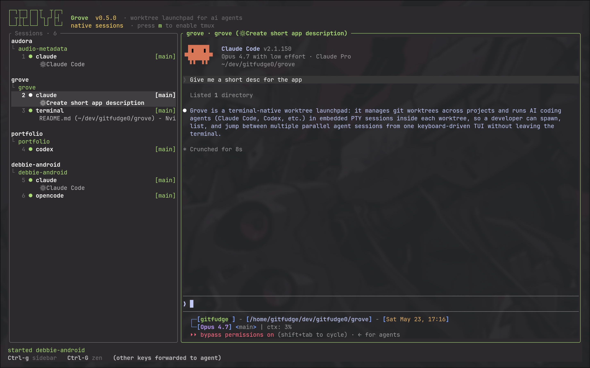

<div align="center">

# grove

a worktree launchpad for ai coding agents



[](#license)
[](#requirements)
[](https://www.rust-lang.org/)
[](Cargo.toml)

</div>

grove is a terminal-native TUI that manages git worktrees across projects and runs ai coding agents (claude code, codex, opencode) in embedded PTY sessions inside each worktree. several agents run side by side. you never leave the terminal.

## table of contents

- [why grove](#why-grove)
- [install](#install)
- [quickstart](#quickstart)
- [sessions](#sessions)
- [keybindings](#keybindings)
- [supported agents](#supported-agents)
- [themes](#themes)
- [requirements](#requirements)
- [uninstall](#uninstall)
- [license](#license)

## why grove

if you regularly drive more than one ai coding agent at a time, you have probably ended up with a tab graveyard, a forest of detached tmux sessions, or a window manager full of nearly-identical terminals. grove collapses that into one keyboard-driven surface.

- **one screen, two modes.** a browser for projects and worktrees, and a session view with a sidebar of every live agent next to the focused PTY. no tabs, no nested navigation.
- **sessions are the unit of work.** every agent you spawn lives in a managed session you can jump to in one or two keystrokes. `Ctrl-g` toggles between the sidebar and the PTY; number keys jump straight to a session.
- **worktrees, not branches.** grove treats `git worktree` as a first-class primitive. create, list, and destroy worktrees per project, and launch agents directly inside them.
- **terminal-native.** no electron, no web view. runs in any modern terminal, picks up your colors, ships with 36 built-in themes (22 dark, 14 light).
- **stays out of the way.** a green ● next to a project means something is running there. that is the entire status system. no badges, no toasts, no progress rings.
- **persistent by default.** with tmux installed, sessions survive grove exits and are rediscovered on the next launch. without tmux, native mode runs PTYs directly.

## install

one-liner (requires `git` and a rust toolchain):

```sh
curl -fsSL https://raw.githubusercontent.com/gitfudge0/grove/main/install.sh | bash
```

or clone and install locally:

```sh
git clone https://github.com/gitfudge0/grove.git
cd grove
./install.sh
```

the `grove` binary is installed to `$CARGO_HOME/bin` (default `~/.cargo/bin`). make sure that directory is on your `PATH`.

## quickstart

```sh
grove                       # launch the TUI
# inside grove:
#   a                       # add a project (point at a git repo)
#   l                       # focus the worktrees pane
#   a                       # add a worktree
#   enter                   # start an agent session in that worktree
```

that is the entire onboarding. every other binding is on the footer.

## sessions

agents run as managed sessions rather than replacing grove. the session view has a **sessions** sidebar on the left (every project → worktree → session) and the active session's PTY on the right.

`Ctrl-g` toggles keyboard focus between the two. press it from the PTY to move into the sidebar, where you can browse sessions; press it again (or `enter`) to drop back into the PTY. every other keystroke in the PTY is forwarded to the agent.

grove supports two session backends:

| backend | when to use | persistence |
|---|---|---|
| **tmux** | recommended when `tmux` is installed | sessions survive grove exits and are rediscovered on next launch |
| **native** | no tmux dependency | sessions end when grove exits |

on first launch with `tmux` installed, grove asks which backend to use. press `m` later to open the tmux settings modal, toggle tmux for new sessions, and copy the optional tmux config snippet. existing sessions keep the backend they were started with.

## keybindings

### browser (projects / worktrees)

| key | action |
|---|---|
| `j` / `k`, `↑` / `↓` | move |
| `h` / `l`, `←` / `→`, `tab` | switch between projects and worktrees |
| `enter` | open or focus a session for the worktree (default agent) |
| `c` / `C` | new session for the worktree (default / pick agent) |
| `t` | new terminal session in the worktree |
| `T` | theme picker |
| `a` / `d` | add / delete |
| `r` | refresh |
| `m` | tmux settings and setup snippet |
| `Ctrl-g` | jump to the active session pane |
| `?` | help |
| `q` / `esc` | quit |

### sessions sidebar

| key | action |
|---|---|
| `j` / `k` | next / previous session (updates the right pane live) |
| `1`–`9` | jump to session N |
| `Ctrl-g` / `enter` | focus the session's PTY |
| `esc` | back to the projects browser |
| `d` | kill the active session (worktree stays) |
| `c` / `C` | new session for the active worktree (default / pick agent) |
| `t` | new terminal for the active session's worktree |

projects and worktrees with running sessions are marked with a green ● and a session count in the browser.

## supported agents

| agent | command |
|---|---|
| claude code | `claude` |
| codex | `codex` |
| opencode | `opencode` |
| terminal | your login shell, for ad-hoc work in a worktree |

each agent must be installed and available on your `PATH`. grove does not bundle, update, or authenticate any agent; it spawns them.

## themes

grove ships with 36 themes (22 dark, 14 light). the default is tokyonight. press `T` from the browser to open the theme picker; the selection persists across launches.

themes are colorways, not chrome. every screen reads correctly across all 36, because grove paints by semantic role (`fg`, `bg`, `comment`, `green` for running state, `yellow` for keybinding letters, `red` for errors) rather than fixed hex values. see [DESIGN.md](DESIGN.md) for the role contract.

## requirements

- rust toolchain (`cargo`) for installation from source
- `git`
- a unix-like terminal (linux or macOS)
- `tmux` (optional, recommended for persistent sessions)

## uninstall

```sh
./uninstall.sh
```

removes the `grove` binary. your project registrations and theme settings live under `~/.config/grove` and are left in place; delete that directory if you want a clean slate.

## license

[MIT](LICENSE).
