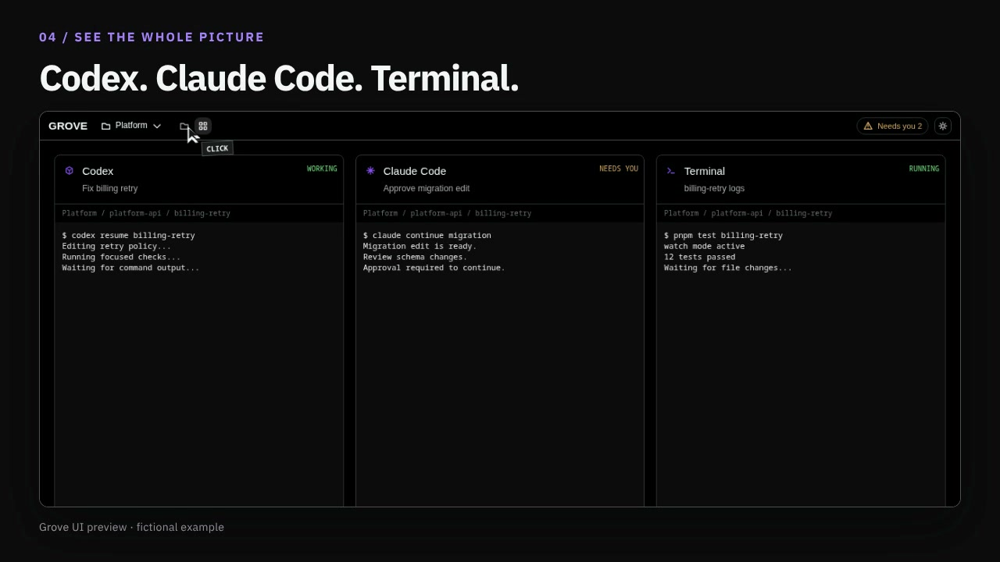

<div align="center">

# grove

a worktree launchpad for ai coding agents

[](assets/showcase/grove-launch.mp4)

[Watch the 22-second Grove UI preview](assets/showcase/grove-launch.mp4)

_Illustrated Grove UI with fictional project data. Music: [Happy Beats & Business Moves Vol. 12](https://ende.app/en/song/12881-happy-beats-business-moves-vol-12) by Sascha Ende ([CC BY 4.0](https://creativecommons.org/licenses/by/4.0/))._

[](#license)
[-7aa2f7?style=flat-square)](#requirements)
[](https://www.rust-lang.org/)

</div>

grove is a native desktop app for managing git worktrees across projects and running ai coding agents (claude code, codex, opencode) in embedded PTY sessions inside each worktree. several agents run side by side, with optional tmux persistence when you want sessions to survive restarts. the old terminal UI has been removed; `grove` now opens the desktop app directly.

## table of contents

- [why grove](#why-grove)
- [install](#install)
- [quickstart](#quickstart)
- [sessions](#sessions)
- [CLI and agent delegation](#cli-and-agent-delegation)
- [keyboard](#keyboard)
- [supported agents](#supported-agents)
- [appearance](#appearance)
- [requirements](#requirements)
- [telemetry](#telemetry)
- [uninstall](#uninstall)
- [license](#license)

## why grove

if you regularly drive more than one ai coding agent at a time, you have probably ended up with a tab graveyard, a forest of detached tmux sessions, or a window manager full of nearly-identical terminals. grove collapses that into one focused surface.

- **projects, worktrees, and sessions in one place.** the sidebar can show a project tree, a flat activity stream of every session, or a persistent home terminal.
- **sessions are the unit of work.** every agent you spawn lives in a managed session with an embedded PTY. switch sessions without leaving grove, or open a worktree terminal beside an active agent.
- **worktrees, not branches.** grove treats `git worktree` as a first-class primitive. create, list, and destroy worktrees per project, and launch agents directly inside them.
- **desktop app, terminal-native sessions.** `grove` opens the native app; sessions still run as real PTYs inside it.
- **native PTYs.** agents run as real terminal sessions, so full-screen CLIs, mouse selection, paste, scrollback, and terminal output behave like terminal work.
- **stays out of the way.** running sessions are visible in the sidebar without turning the app into a dashboard.
- **persistent by default.** with tmux installed, sessions survive grove exits and are rediscovered on the next launch. without tmux, native mode runs PTYs directly.

## install

one-liner (requires `git` and a rust toolchain):

```sh
curl -fsSL https://raw.githubusercontent.com/gitfudge0/grove/main/install.sh | bash
```

or clone and install locally:

```sh
git clone https://github.com/gitfudge0/grove.git
cd grove
./install.sh
```

`install.sh` builds a release bundle with [`cargo-bundle`] (installing it on first run) and installs grove as a clickable native app:

- **macOS** — copies `Grove.app` to `/Applications` (or `~/Applications`). launch it from Spotlight or Launchpad.
- **linux** — installs the generated `.deb` via `dpkg`, or falls back to a binary plus a `grove.desktop` launcher and icon under `~/.local`. launch "Grove" from your application menu.
- **windows (alpha)** — no `install.sh` support yet; download the `.msi` from the [latest release](https://github.com/gitfudge0/grove/releases/latest) and run it. windows support is new and less battle-tested than macOS/linux — expect rough edges, and please file issues.

when launched from a desktop menu or app launcher, grove recovers your shell’s exported environment (including `PATH`) once on startup, so it can find `claude`, `git`, and your agents without starting another login shell for every session. grove refreshes the environment automatically every 10 minutes, or use **Settings → Shell environment → Refresh now** after changing exported variables. refreshes apply to new sessions; existing sessions stay unchanged. set `GROVE_FORCE_LOGIN_PATH=1` to force this even from a terminal. on windows, grove uses `pwsh` (PowerShell 7+) when available, falling back to the built-in `powershell.exe`.

[`cargo-bundle`]: https://github.com/burtonageo/cargo-bundle

## quickstart

```sh
grove                       # launch the desktop app
```

then:

1. add a project by choosing a local folder. grove can use an existing git repository, initialize git, or use the folder without git.
2. start in the main checkout, or create a separate worktree for an existing git repository with at least one commit. a newly initialized repository needs its first commit before you can create another worktree. folders without git can still run sessions, but cannot create worktrees.
3. start `claude`, `codex`, `opencode`, or a terminal session in the chosen checkout. if an agent CLI is missing, you can still start a terminal.

the app exposes common actions as row controls, toolbar buttons, and keyboard shortcuts. there is no separate `grove tui` mode.

## sessions

agents run as managed sessions rather than replacing grove. each session belongs to a project and worktree, and the active session renders as an embedded PTY.

the desktop app has three sidebar views:

| view | purpose |
|---|---|
| **tree** | projects, worktrees, and their sessions |
| **activity** | all sessions grouped by running, idle, and worktrees with no sessions |
| **terminal** | persistent home terminals rooted at `~` |

from an active desktop session, the `term` control opens a right-docked shell for the same worktree. you can keep the agent on one side and run git, tests, or edits in the adjacent terminal panel.

the `mod+n` launcher doubles as a command palette: recent worktrees first, plus settings, and each project's setup/run/teardown scripts as row actions.

grove supports two session backends:

| backend | when to use | persistence |
|---|---|---|
| **tmux** | recommended when `tmux` is installed | sessions survive grove exits and are rediscovered on next launch |
| **native** | no tmux dependency | sessions end when grove exits |

when you start your first managed project session with `tmux` installed, grove asks which backend to use. use the `native` / `tmux` controls in the app chrome to choose the backend for new sessions. existing sessions keep the backend they were started with.

## CLI and agent delegation

`./install.sh` also installs `grove` into `${CARGO_HOME:-$HOME/.cargo}/bin` as a link to the installed desktop executable, replacing legacy Cargo-installed binaries. keep that directory on your `PATH`; updates then update both the desktop and CLI together. existing shells may need `hash -r` (bash) or `rehash` (zsh) after installation.

with the desktop running, the `grove` CLI can discover projects, create worktrees, launch and inspect sessions, and track delegated tasks. control uses a private local Unix socket on linux/macOS; Windows CLI control is not supported yet. it does not start a headless service or open the desktop automatically. bare `grove` still opens the desktop; `grove --help` and `grove --version` work without it.

```sh
grove projects list --json
grove worktrees list --project /path/to/project --json
grove sessions start --project /path/to/project --worktree /path/to/worktree \
  --agent codex --backend tmux --prompt-file /path/to/prompt.txt \
  --task-title "Implement the parser" --task-file /path/to/prompt.txt \
  --request-id parser-worker-1 --json
grove sessions logs SESSION_ID --lines 100 --json
grove tasks wait TASK_ID --timeout 60 --json
```

use the returned session/task IDs and `grove <command> --help` for command details. responses are versioned JSON envelopes with `{version, ok, data, error}` and the executed request ID; `--json` is accepted anywhere. reuse the same request ID and identical inputs when retrying a launch after a lost response. pending requests after a crash require inspecting sessions/tasks before recovery. logs return bounded current-screen text, not a historical transcript. if you set `GROVE_CONFIG_DIR` for the desktop, use the same value for CLI commands.

task records persist across restarts. workers receive `GROVE_TASK_ID` and `GROVE_CONFIG_DIR`, and explicitly submit a result with `grove tasks complete TASK_ID --result-file /path/to/result.json`; a result is a worker report that the coordinator still needs to verify. terminal activity and sidebar “done” signals do not establish success. native sessions end on desktop exit; tmux sessions can reconnect. check the returned backend because a failed tmux launch can fall back to native. launches honor Grove's existing agent permission settings.

the repository includes a [Grove skill](skills/grove/SKILL.md) for agents coordinating independent tasks in separate worktrees. to install it for Codex, run `grove skills install --agent codex` or use Settings → Skills, then use `$grove`. the user-scope location is `~/.agents/skills/grove`; add `--project /absolute/project` for project scope. installation is optional.

## keyboard

`mod` is `cmd` on macOS and `ctrl+shift` on linux.

| shortcut | action |
|---|---|
| `mod+n` | open the launcher / command palette |
| `cmd+alt+n` (macOS) / `ctrl+alt+n` | new session in the current worktree — note: no shift, so this is not `mod+alt+n` |
| `mod+j` / `mod+k` | next / previous session outside grid view |
| `mod+←↓↑→` / `mod+h j k l` | move focus to an adjacent grid tile |
| `mod+alt+←↓↑→` / `mod+alt+h j k l` | swap the focused grid tile with its neighbor (`mod+shift` also works on macOS) |
| `mod+1`..`mod+9` | select the nth session |
| `mod+g` | toggle the grid (agent view) |
| `mod+r` | enter grid resize mode while the grid is open |
| `←↓↑→` / `h j k l` | move the split beside the focused tile by 5% in grid resize mode |
| `shift+←↓↑→` / `shift+h j k l` | move that split by 1% in grid resize mode |
| `enter` / `esc` | leave grid resize mode |
| `mod+enter` | toggle zen mode |
| `mod+,` | open settings |
| `mod+=` / `mod+-` / `mod+0` | zoom in / out / reset |
| `mod+w` | request to close the focused session (confirm in the prompt) |
| `mod+c` / `mod+v` | copy selection / paste into the focused session |
| `ctrl+shift+←` / `ctrl+shift+→` | resize the terminal panel (workspace view only) |
| `mod+/` | show the shortcut overlay |
| `esc` | close modals |

everything else on the keyboard goes straight to the focused session's PTY.

grid seams can also be dragged with the mouse. double-click one seam to reset only that split. grid sizing lasts for the current grove run and resets to equal shares when the grid topology changes.

## supported agents

| agent | command |
|---|---|
| claude code | `claude` |
| codex | `codex` |
| opencode | `opencode` |
| terminal | your login shell, for ad-hoc work in a worktree |

each agent must be installed and available on your `PATH`. grove does not bundle, update, or authenticate any agent; it spawns them.

## appearance

grove uses fixed light and dark palettes. In settings, choose System to follow your OS, or select Dark or Light. The choice persists across launches.

## release highlights

Release carousels are authored in `assets/highlights/manifest.json` and bundled with Grove; release notes are not converted into slides at runtime. Each release entry uses the exact installed version (for example `1.0.2`). Set `enabled: true` only for releases you want to show automatically. A disabled entry is a draft and does not interrupt normal launches.

For an enabled release, Grove opens the media-first carousel once on first launch of that version and records that version as seen. You can dismiss it at any time. Other versions do not inherit that release's carousel. You can replay an enabled carousel from Settings → Changelog → View highlights.

Choose two to four user-visible changes, write a benefit-led title and a short description, and capture the released UI using clean demo projects. Keep media under `assets/highlights/<version>/`; each slide needs a stable `id`, `title`, `description`, and `media` with `kind`, `src`, and descriptive `alt` text. Supported kinds are `image`, `gif`, and `video`. GIFs and videos require a `poster` image. GIFs start playing automatically and provide Pause/Play controls; reduced motion keeps the poster still. Videos open in the system player from Play video. Keep screenshots and posters legible at the carousel size. Images and GIFs may optionally include `frame` with `zoom` (1–8), the source `aspect_ratio`, and `position_x` / `position_y` (0–1, from left/top to right/bottom). An optional `highlight: [left, top, width, height]` outlines a feature using normalized coordinates in the source image. Framed images and GIFs zoom within the clipped media area; omitted framing preserves the full image. GIF posters must use the same dimensions and framing as the animation.

To test a draft without consuming its first-launch state, use a debug build:

```sh
GROVE_HIGHLIGHTS_DEBUG=1 GROVE_HIGHLIGHTS_VERSION=1.0.2 cargo run
```

`GROVE_HIGHLIGHTS_DEBUG=1` opens the selected carousel at every launch of a debug build, including disabled drafts. `GROVE_HIGHLIGHTS_VERSION` selects an authored version for preview; it does not change normal release selection. Settings → Changelog → Preview release highlights reopens it as often as needed; in a debug build, `cmd+shift+h` on macOS (`ctrl+shift+h` elsewhere) also opens the preview. Release builds ignore the debug override. Use `GROVE_CONFIG_DIR=/tmp/grove-highlights-test` and `GROVE_TELEMETRY=off` for an isolated review workspace.

The first `1.0.2` slide uses a two-state GIF captured from the native app, with a 1.5-second hold on the expanded and collapsed sidebar. The outlined toggle follows its real position in each state; The loop starts automatically; Pause animation keeps the poster still.

The `1.0.2` entry is a disabled draft of changes since published `v1.0.1`: the compact sidebar, moving projects between workspaces, and confirmation before closing running sessions. Enable it when those highlights are ready to ship.

## requirements

- rust toolchain (`cargo`) for installation from source
- `git`
- linux, macOS, or windows (alpha) with a graphical desktop session
- `tmux` (optional, recommended for persistent sessions — macOS/linux only; windows always runs native sessions)

## telemetry

grove sends anonymous usage events: app launch (project count, tmux setting), an hourly heartbeat, session created/ended (agent type, native vs tmux, duration in minutes, open-session counts), worktree created, update applied/declined (version), error kinds (session spawn or worktree creation failed — the kind only, no details), UI feature pings (launcher/settings opened, zoom changed, grid tile moved), and panic messages — each tagged with app version and OS.

it never sends project names, file paths, git data, prompts, or session/terminal content.

to disable, toggle "share anonymous usage data" off in the settings modal, or set `GROVE_TELEMETRY=off` in your environment.

## uninstall

```sh
./uninstall.sh
```

removes the app bundle (or `.deb`/`~/.local` install on linux) that `install.sh` installed. your project registrations and appearance setting live under `~/.config/grove` and are left in place; delete that directory if you want a clean slate.

## license

[MIT](LICENSE).
