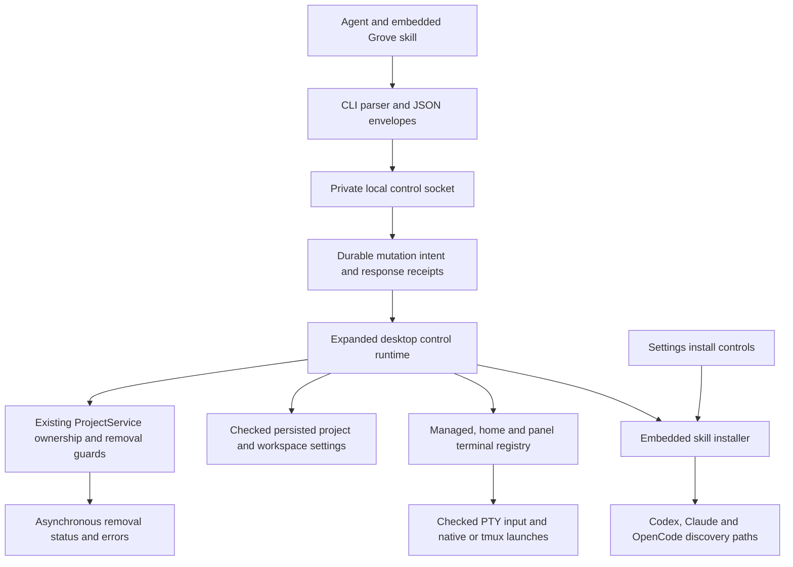

# Code Review - feat/cli-agent-management

## Summary

The CLI now exposes project and workspace lifecycle operations, worktree removal, shells, terminal input, context roots, and agent skill installation through existing desktop services. Initial review found false-success and retry-uncertainty defects; the inspected follow-up fixes address those defects. Source review is approved and the coordinator independently observed the final installed-release Codex lifecycle acceptance pass.

## Review scope and snapshot

Review used Git commands for analysis; no builds, tests, servers, or acceptance commands were run by this reviewer. Requested implementation baseline: `e68c1e3cdaf5cd1bac619f3610a7b79a7d20b890`. Current branch contains that inherited commit relative to main `da5106dfb482339059e7891b99e878a88c2d1f17`; its sidebar changes were inspected as context and are outside this task's implementation delta. The feature implementation was still dirty when reviewed, including the new installer and native acceptance script.

Inspected Git blob IDs:

| File | Blob |
|---|---|
| src/control_runtime.rs | e6a1887d4220f4f5317a8dd06f8b2e29fdc5d8fe |
| src/cli.rs | af05c37f90890b73172692468ec4e64c04bf87e8 |
| src/entities/session_registry.rs | 4fcbb0f2cfec9e677f61cc87a6baf987337b4f00 |
| src/entities/terminal_session.rs | c8bb4f6dcbee96c0085050571a3b5b68de38fab1 |
| src/views/settings_panel.rs | 2b0aef6567566dfed39ce0d104cf647f4ecf2651 |
| crates/grove-core/src/control.rs | a9f0506306c8409840f0bea7f42b4142efa2b38b |
| crates/grove-core/src/skill_install.rs | 043ad92db61ee9cc51644329d31e77f50963f04b |
| src/project_service.rs | ec94c91403aca2ed546040f22d9ceec983a3c79d |
| skills/grove/SKILL.md | 23a5d0281e7306bebfdc7b2de28c51f11230fb30 |
| install.sh | f1b79d88cb29ece4ffed05aba0f0f9114db74001 |
| scripts/verify-cli-agents.py | 936392b3e5cdb73504aba0d48cf3f2c06d54fff3 |

Hashes identify inspected bytes, not test success. Subsequent source changes require impact review.

## Files Changed

| File Path | Change Type | Purpose of Changes | Lines Changed | Impact Assessment |
|---|---|---|---|---|
| crates/grove-core/src/control.rs | Modified | Versioned command variants and backwards-compatible optional launch fields | +89/-0 | Public control contract |
| crates/grove-core/src/lib.rs | Modified | Export installer | +1/-0 | Low |
| crates/grove-core/src/skill_install.rs | Added | Embedded skill, agent discovery paths, status, conflict and symlink guards | 233 added | Filesystem writes |
| src/cli.rs | Modified | Parsing, help, lifecycle and input commands | +215/-1 | User-facing CLI |
| src/control_runtime.rs | Modified | Shared live-service dispatch, mutation receipts, shells, input and roots | +497/-29 | Session and destructive lifecycle |
| src/entities/session_registry.rs | Modified | Enumerate and resolve managed, home and panel terminals | +29/-0 | Session visibility |
| src/entities/terminal_session.rs | Modified | Checked input and config propagation to ordinary launches | +36/-16 | PTY delivery and child configuration |
| src/project_service.rs | Modified | Target-specific teardown skip wrapper | +16/-0 | Destructive-operation safety |
| src/views/settings_panel.rs | Modified | User/project install scope and agent status/actions | +95/-0 | GUI and filesystem |
| skills/grove/SKILL.md | Modified | Full CLI operating guidance and ownership marker | +40/-3 | Agent behavior |
| install.sh | Modified | Honor custom Cargo target directory | +5/-4 | Local installation |
| scripts/verify-cli-agents.py | Added | Disposable native and prompted Codex acceptance harness | 61 added | Verification fixture |

Planning, decision-log, and run-state artifacts are delivery records rather than production behavior.

## System Flow Impact

## Critical Issues

No open P1 issue in the inspected follow-up implementation. Initial P1 input-delivery finding is fixed as described below.

## Initial findings and follow-up dispositions

1. **P1, fixed — Input falsely reported success.** Initial `src/control_runtime.rs:392` called the existing void `send`, which silently ignored missing PTYs and discarded write errors. A surviving tmux session could be pending attachment, so input was lost while a success receipt prevented retransmission. Follow-up attaches pending terminals and calls `send_checked`; absent PTYs return an error and write failures return outcome uncertainty.
2. **P2, fixed with explicit limitation — Panel focus did not navigate.** Initial `src/control_runtime.rs:653` only selected the panel-shell index and called `focus_pane`, a no-op with a closed panel. Follow-up resolves the owning project/worktree, adopts a managed-session anchor, opens the panel and focuses it. A panel shell without an anchor now returns an explicit error; the skill documents the requirement.
3. **P2, fixed — Shell post-spawn errors concealed uncertain outcome.** Initial `StartShell` propagated post-spawn enumeration failures as ordinary command failures. Follow-up converts both enumeration and missing-row failures to uncertainty so callers inspect existing sessions before issuing replacement requests.
4. **P2, fixed — Run-script post-spawn enumeration concealed uncertain outcome.** Fresh review found the same error path in `RunScript`. Inspected `src/control_runtime.rs:380` now converts enumeration failure to uncertainty.
5. **P2, fixed — Linux custom target fallback.** New target-directory support initially left the Linux fallback reading `target/release/grove`. The refreshed source uses quoted `"$BUILD_DIR/release/grove"`, retaining custom target paths containing spaces.
6. **Documentation, fixed — Context roots.** Both skill paragraphs now require registered checkouts/worktrees and distinguish Claude/Codex arguments from OpenCode/Terminal bundles. Updated guidance also correctly distinguishes project cleanup from individual-worktree teardown and explains carriage-return Enter input.

## Quality Issues

- No unresolved blocking source issue was identified in the refreshed implementation.
- Several runtime match arms are densely formatted. This is maintainability feedback, not a reason to redesign shared services or expand scope.
- Generated `scripts/__pycache__` appeared in an earlier inspection and is absent from the final untracked-file inventory.

## Architecture Feedback

Reusing ProjectService is the right boundary: project rename/archive/deletion and worktree removal retain canonical ownership checks and the GUI's teardown lifecycle. The new read-command allowlist routes all other commands through durable mutation receipts, reducing omission risk for future mutations. Home/panel registry access is centralized rather than duplicated between command handlers.

Panel focus relies on a managed-session anchor because the current layout belongs to managed worktrees. This limitation is explicit and should remain visible in help/skill guidance; it should not be reported as successful focus when the anchor is absent.

## Security Assessment

Prompt and input files remain literal data; launch text is passed through agent arguments rather than shell interpolation. Destructive commands resolve registered targets and require exact confirmation, then reuse existing ownership/main-checkout guards. The installer preserves foreign content by default and refuses symlinked descendants; the CLI's explicit overwrite option is intentional, whereas the GUI does not silently replace conflicts.

The installer uses check-then-write filesystem operations rather than descriptor-relative race-proof traversal. No concurrent adversary is established for this local same-user installer, so this is not a blocking vulnerability claim. Its marker recognizes Grove-managed content; it is not cryptographic ownership proof.

## Performance Analysis

No new large-memory or unbounded-process behavior was identified. Input has a 512 KiB limit; existing frame and receipt limits remain. Settings renders read three small skill files synchronously and expanded command dispatch still enumerates all live sessions before every operation; unusually slow filesystems or many tmux sessions could affect responsiveness, but no measured regression is asserted.

## Testing Evaluation

New source coverage includes workspace/project lifecycle and confirmation guards, idempotent workspace creation, home/panel enumeration and stopping, repeat-root parsing, explicit branch parsing, unattached checked-input rejection, installer conflicts/updates, and symlink refusal. Existing service tests cover main-checkout protection, nested registered projects, teardown failures and ownership.

Important evidence boundaries:

- Reviewer did not execute tests. Coordinator reports independent raw-output verification: nextest 1,083/1,083 passed with one excluded baseline recent-worktree failure reproduced on the clean base; clippy all-targets, production format, typos, dependency checks, doctests and cargo-deny passed.
- New panel tests assert a successful response with an anchor but do not assert cross-worktree navigation or closed-panel visibility. Native GUI inspection should cover those states.
- Checked-input unit coverage rejects an unattached terminal; actual attachment, successful byte delivery and write failure uncertainty need runtime evidence or a meaningful injection harness.
- The final harness matches the proof's child task ID to its actual completed task and session ID, checks retained marker evidence, verifies restored project name/workspace/archive state, confirms only main worktrees remain, and confirms child-session removal. Marker evidence is copied by the parent agent, so the coordinator should additionally inspect child logs/results and command records. The earlier weak any-completed-task gate is removed. Literal shell input now requires an exact output file rather than echoed screen text.
- Coordinator observed actual GUI project installs change from Install to Installed for Codex, Claude and OpenCode and verified identical embedded skill bytes. Those GUI checks used the earlier debug embedded text; final release help and install.sh exit zero were independently observed. Real Codex loaded the skill and operated projects/workspaces/worktrees; its initial run safely refused a child outside the initial scope. The corrected final installed-release harness explicitly authorized returned disposable worktrees and passed with exit zero. Claude/OpenCode agent execution is outside this Codex acceptance.

Final acceptance fixture: `/private/tmp/grove-cli-acceptance-nctzc09b`. Coordinator read raw `codex.log`, proof commands, and child live-screen transcript. Child task `c7c38c381b8814ad06f995ae1c9d85d2` completed and links to session `d761e997e212bbdbc2ddbae6db4e9f1d`; marker bytes were `PROMPT_RECEIVED` followed by a newline. The transcript recorded a sandbox rejection, one-time scoped approval, then actual successful `tasks complete`. Coordinator separately queried the live owner and observed `sessions list = []` and only the main worktree remaining. These observations establish actual prompted child execution and cleanup rather than relying on its success claim.

## Recommendations

- No further change is required for this reviewed scope. Preserve the acceptance fixture and decision log as delivery evidence.

The context-bundle recovery recommendation was addressed in the refresh: prepare the bundle before creating a task, remove it on task creation/context persistence failure, and attempt to mark a created but unlaunched task failed. Installer filesystem calls were aligned with the repository's fs_err convention. These changes were inspected, not merely accepted from a worker report.

## Approval Status

**Status**: approved

Source approval applies to the final refreshed blob snapshot above, including mechanical clippy changes, updated skill guidance and stronger acceptance gates. No unresolved source finding remains. Coordinator-observed checks, GUI installation and the final installed-release prompted child-Codex lifecycle acceptance are complete as recorded above; no source change followed that acceptance.
